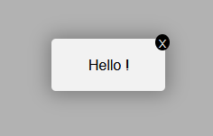

## A small but functional React Modal



### Install

Make sure to use React V18.2.0
Install using `npm install standard-react-modal`

### Usage

In a React app, use the Modal components:
`import { Modal } from 'standard-react-modal'`

### Modal props

| Name         | Description                                                                |
| ------------ | -------------------------------------------------------------------------- |
| text         | a string containing a text                                                 |


### Make it as a component !

- in your component folder, create a file for your modal that you will import later as it should be.

- then, at the top of your component page

`import React from "react";`

`import { Modal } from "standard-react-modal";`

- then, set the props :

```

const yourText =
    "The text would be placed here";

```

- then insert in your function the **Modal** 

```
<Modal   
    text={yourText}  
        />
```

- don't forget to insert `onClick={handleModal}` in a button for exemple

<Button>Submit</Button>

